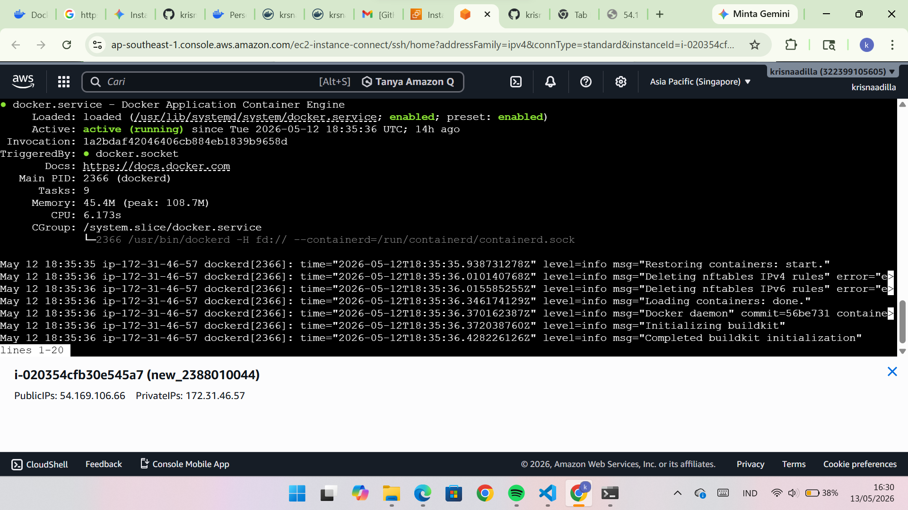
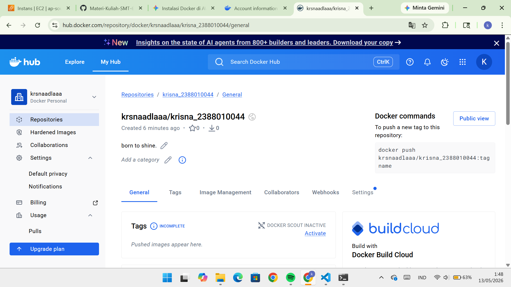
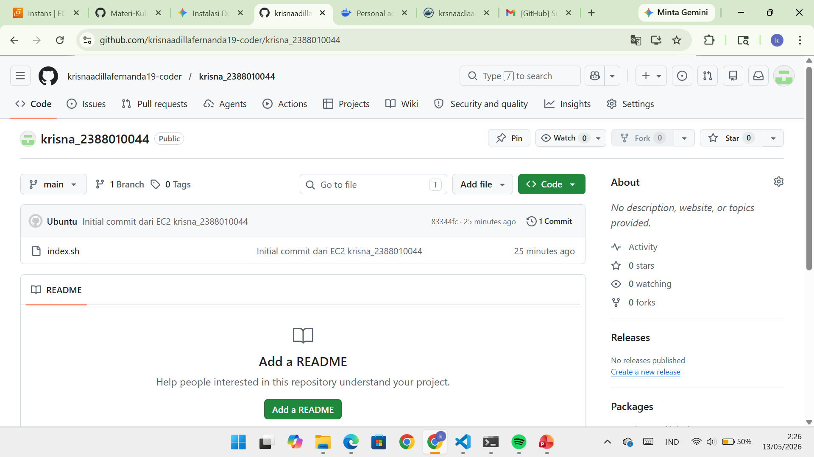
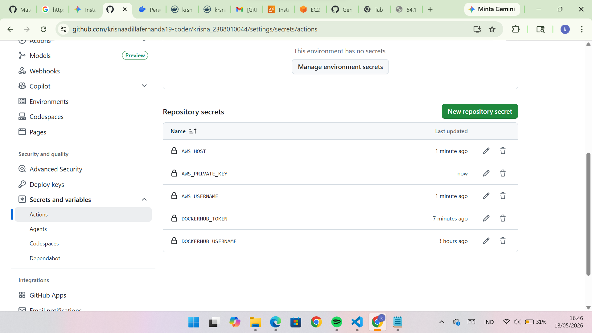
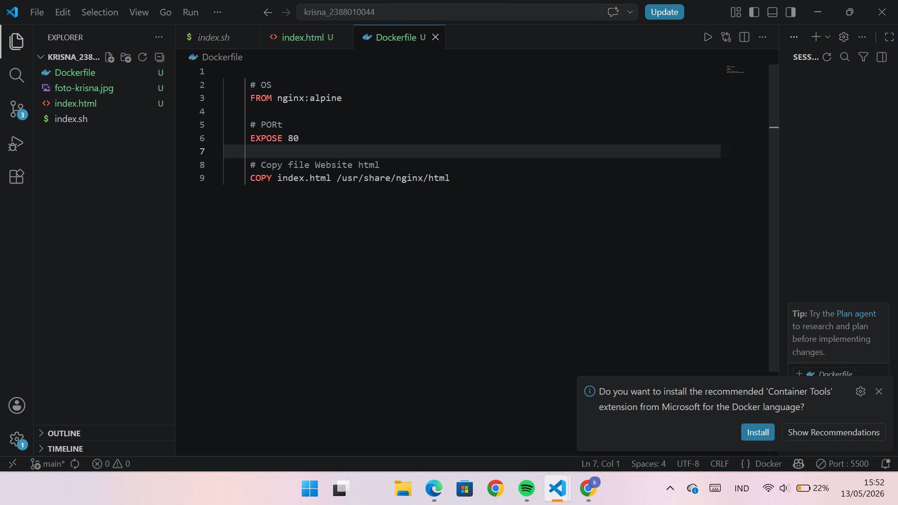
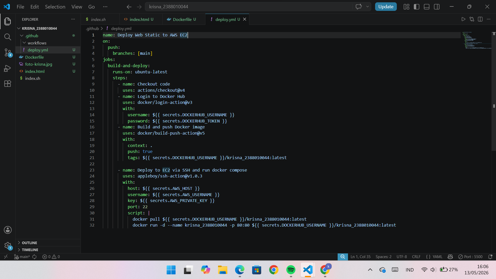
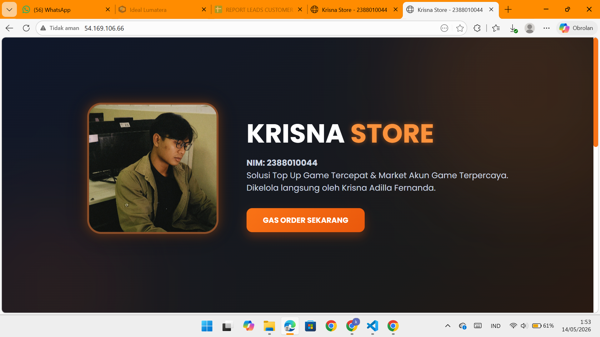

# CI/CD dengan Git -> Github Actions -> Docker hub -> EC2 AWS

1. Start Instance di AWS EC2
2. Patching OS -> sudo apt update && sudo apt upgrade
3. Install Docker di EC2 AWS https://docs.docker.com/
 - Uninstall Docker old version
  (sudo apt remove $(dpkg --get-selections docker.io docker-compose docker-compose-v2 docker-doc podman-docker containerd runc | cut -f1))
  - Set up Apt Docker
  - Install Docker Engine
  - Cek Docker -> systemctl status docker
  

4. Create Gudang / Repo di Docker Hub https://hub.docker.com/
 - Create akun dan login
 - create repo -> (hub->repo->New)
 - Create Tokens ( Klik Profile->Account Setting ->Security ->Access Tokens -> Generate new token)
 - Simpan token jangan sampai hilang
 

 5. Create Repo di Github
 - Membuat Repo baru dengan nama himafor_nim
 - BUat projek di Local 
 - Push ke Github
 

 6. Set Up Github Secret Variables
 - Klik Repo -> Settings -> Secrets and variables -> Actions -> New repository secret 
 - buat secret "DOCKERHUB_USERNAME" with your Docker Hub username
 - buat secret "DOCKERHUB_TOKEN" with your Docker Hub token
 - AWS_USERNAME isi username EC2 AWS kamu (ubuntu)
 - AWS_PRIVATE_KEY isi private key 
 - AWS_HOST isi public IP EC2 AWS kamu
 

 7. Membuat Resep lingkungan Pengembangan (Dockerfile)
 - Buat file Dockerfile di root repo kamu 
 - Isi Dockerfile dengan kode berikut:

     <!-- OS -->
     From nginx:alpine
    
     <!-- PORt -->
     Expose 80

     <!-- Copy file Website html -->
     Copy index.html /usr/share/nginx/html

8. Membuat CI/CD Workflow (Github Actions) di Repositori Github
 - Buat folder .github/workflows/
 - Buat File deploy.yml di folder .github/workflows/
 - Isi deploy.yml dengan kode berikut:

9. Pastikan semua tidak ada konflik termasuk permission
 - Stop dan disable nginx -> sudo systemctl stop nginx 
 - sudo systemctl disable nginx
 - add ubuntu to docker group -> sudo usermod -aG docker ubuntu
 - commit dan push -> dan cek di website

 