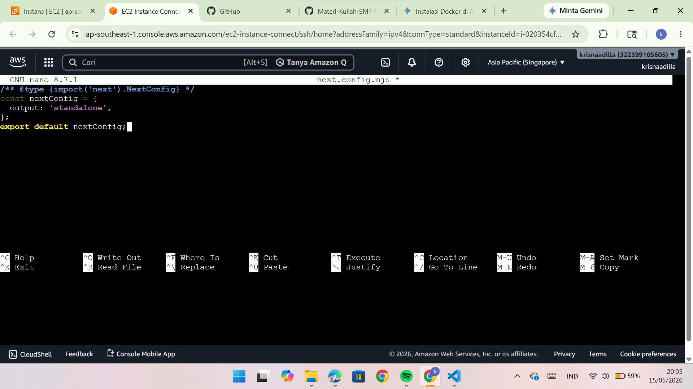
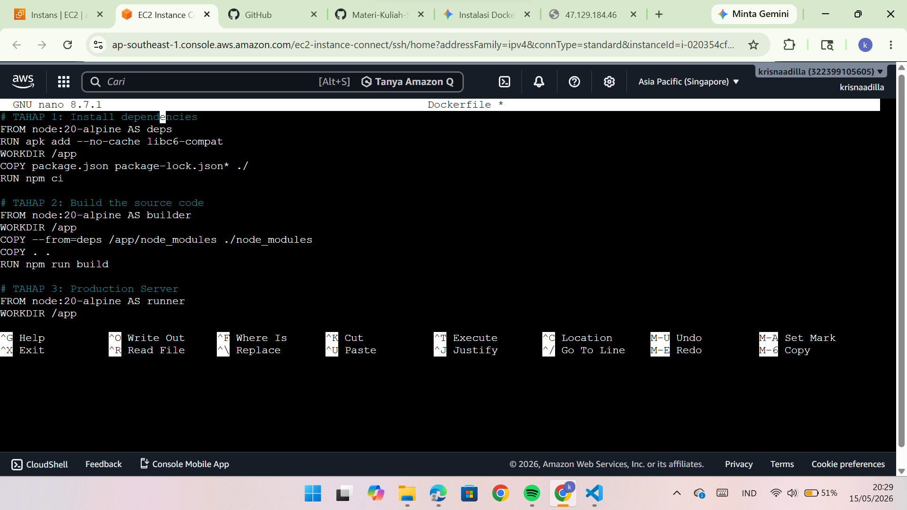
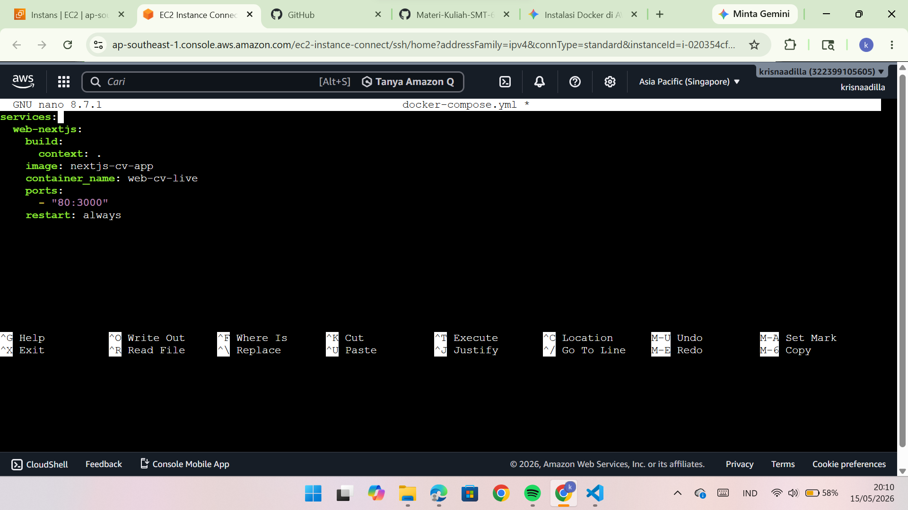

# DEPLOYMENT NEXT.JS STANDALONE

1. Persiapan Konfigurasi Next.js
- Masuk ke Folder Proyek
Pastikan kamu masuk ke folder di mana file package.json itu berada, karena File Saya Ada Di Compro, maka:
cd ~/Compro
Ketik: nano next.config.mjs
Isi dengan Kode berikut: 
/** @type {import('next').NextConfig} */
const nextConfig = {
  output: 'standalone',
}
export default nextConfig;

Pastikan isinya memiliki baris output: 'standalone':

2. Eksekusi Deployment
- Buat Dockerfile Multi-stage
Ketik: nano Dockerfile
Hapus semua isinya, lalu Copy-Paste kode standar industri ini:
# TAHAP 1: Install dependencies
FROM node:20-alpine AS deps
RUN apk add --no-cache libc6-compat
WORKDIR /app
COPY package.json package-lock.json* ./
RUN npm ci

# TAHAP 2: Build the source code
FROM node:20-alpine AS builder
WORKDIR /app
COPY --from=deps /app/node_modules ./node_modules
COPY . .
RUN npm run build

# TAHAP 3: Production Server
FROM node:20-alpine AS runner
WORKDIR /app
ENV NODE_ENV production
RUN addgroup --system --gid 1001 nodejs
RUN adduser --system --uid 1001 nextjs

COPY --from=builder /app/public ./public
COPY --from=builder --chown=nextjs:nodejs /app/.next/standalone ./
COPY --from=builder --chown=nextjs:nodejs /app/.next/static ./.next/static

USER nextjs
EXPOSE 3000
ENV PORT 3000
CMD ["node", "server.js"]

- Buat File Docker Compose
Ketik: nano docker-compose.yml   
Tuliskan konfigurasi ini (Gunakan SPASI, jangan tombol TAB):
services:
  web-nextjs:
    build:
      context: .
    image: nextjs-cv-app
    container_name: web-cv-live
    ports:
      - "80:3000"
    restart: always

- Jalankan Deployment (Build & Run)
docker compose up -d --build