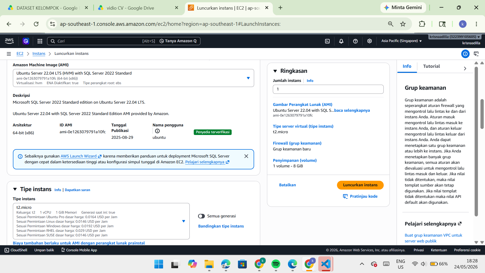
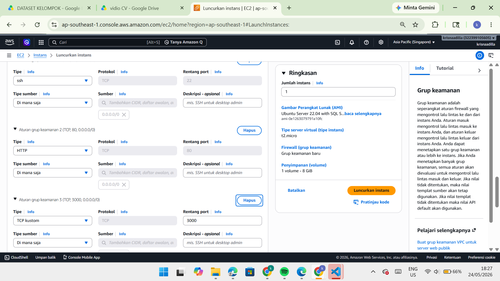
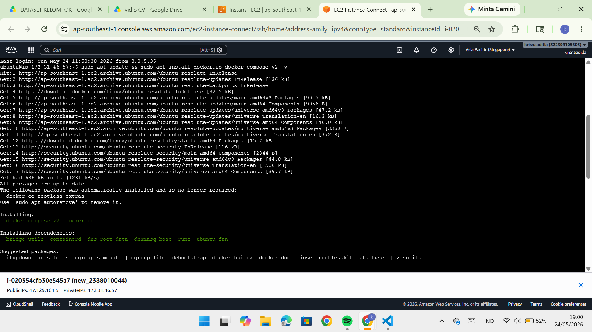
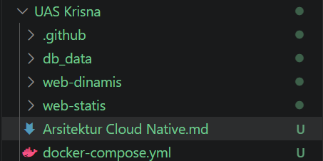

# Membangun Arsitektur Cloud Native dengan 2 Aplikasi Web (Web CV statis dari UTS dan Web Dinamis Next.js)

# Langkah 1: Setup AWS (Sesuai Aturan)
Instruksi UAS mengharuskan kamu membuat instance baru UAS-NIM.
1. Launch Instance:
- Name: UAS-2388010044   
- AMI: Ubuntu Server 22.04 LTS (atau 24.04).
- Instance Type: t2.micro (gratis).
- Key pair: Buat baru jika belum ada, simpan file .pem-nya.

2. Security Group (PENTING):
- Buka Inbound Rules:
- Type: SSH, Port: 22, Source: Anywhere.
- Type: HTTP, Port: 80, Source: Anywhere.  
- Type: Custom TCP, Port: 3000, Source: Anywhere (untuk Next.js).

3. Setelah Instance "Running":
- Copy Public IP instance tersebut. Kita akan pakai ini terus.

# Langkah 2 Persiapan Server (Setelah AWS Baru Nyala)
Jalankan perintah ini di terminal EC2
- Update & Install Docker:
sudo apt update && sudo apt install docker.io docker-compose-v2 -y
- Masukkan user ke grup docker agar tidak perlu pakai sudo terus:
sudo usermod -aG docker $USER
- REBOOT SERVER AGAR GRUP UPDATE:
sudo reboot

# Langkah 3: Setup Repositori & Folder UAS
Di komputer lokal kamu, buat struktur folder seperti ini

# Langkah 4: Docker Compose "Sangat Baik" (Bobot 20%)
Gunakan file ini di docker-compose.yml di folder root:  