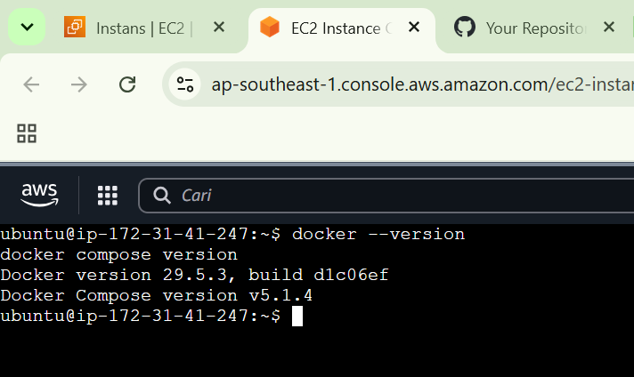
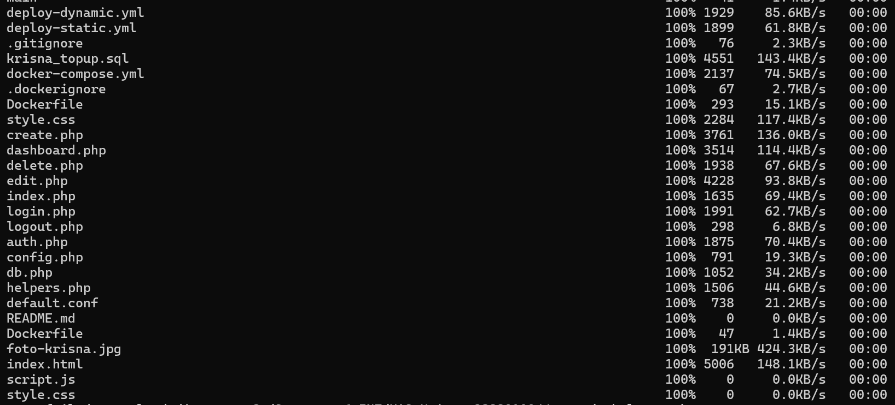
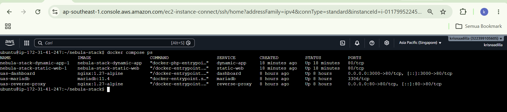
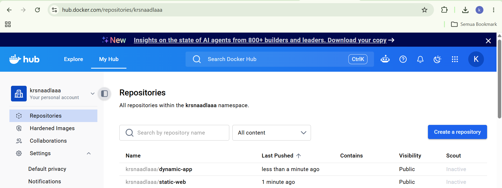
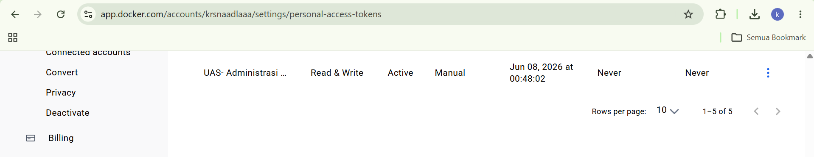
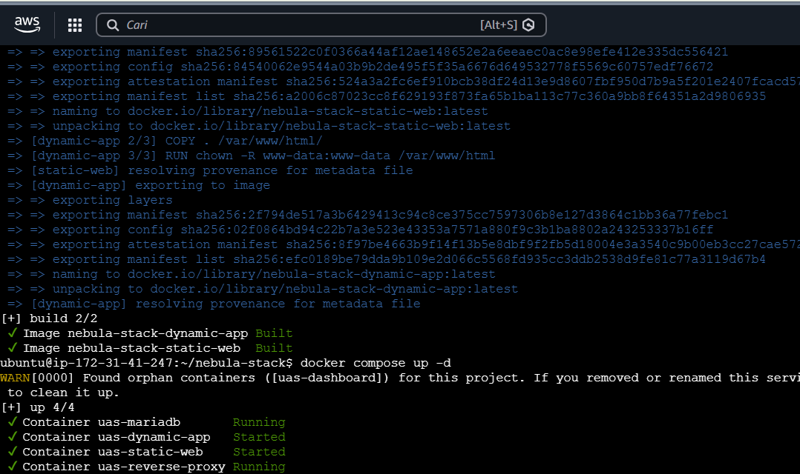
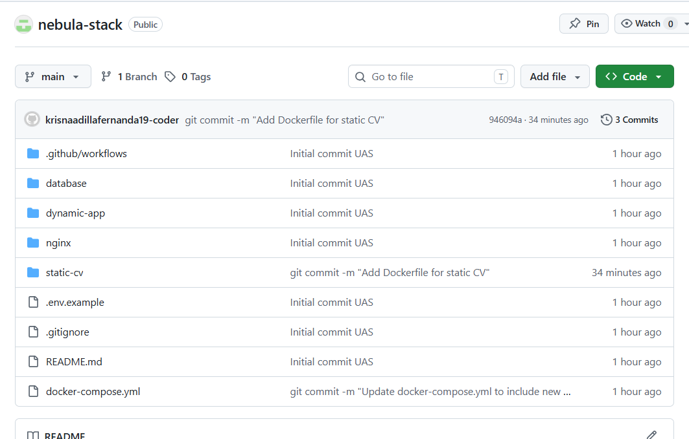
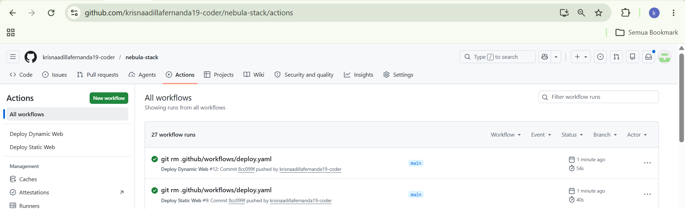
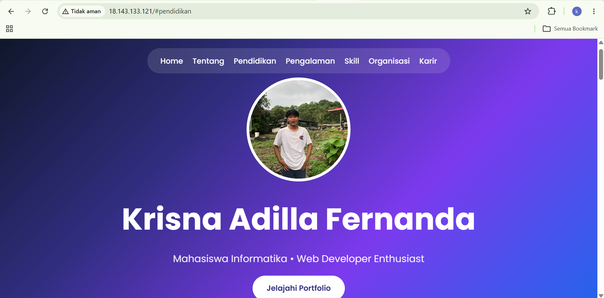

# **Ujian Akhir Semester : Deploy 2 System Apps Static Web dan Dynamic Web**
### 1. Membuat Insteance baru pada AWS Region ap-southeast-1 Singapore

### 2. Membuat Folder Project UAS

### 3. Masukkan web static UTS ke dalam folder Project UAS-CLOUD/static-cv

### 4. Membuat dynamic-app menggunakan PHP 

### 5. Install Docker dari repository resmi Docker (jalankan dipowershell)
    "sudo apt update"
    "sudo apt install -y ca-certificates curl gnupg"
    "sudo install -m 0755 -d /etc/apt/keyrings"
    "curl -fsSL https://download.docker.com/linux/ubuntu/gpg | sudo gpg --dearmor -o /etc/apt/keyrings/docker.gpg"
    "sudo chmod a+r /etc/apt/keyrings/docker.gpg"
    ". /etc/os-release"
    "echo "deb [arch=$(dpkg --print-architecture) signed-by=/etc/apt/keyrings/docker.gpg] https://download docker.com/linux/ubuntu ${VERSION_CODENAME} stable" | sudo tee /etc/apt/sources.list.d/docker.list > /dev/ null"
    "sudo apt update"
    "sudo apt install -y docker-ce docker-ce-cli containerd.io docker-buildx-plugin docker-compose-plugin"

    LALU AKTIFKAN DOCKER
    "sudo systemctl enable docker"
    "sudo systemctl start docker"
    "sudo usermod -aG docker ubuntu"

    LALU CEK APAKAH DOCKER BERHASIL DIINSTALL
    "docker --version"
    "docker compose version"

### 6. Upload Folder Project ke EC2 melalui PowerShell
    JALANKAN
    scp -i "C:\Semester 6 INF\2388010044_UAS.pem" -r "C:\Semester 6 INF\UAS-Krisna-2388010044" ubuntu@IP_Baru:~/nebula-stack

    LALU JALANKAN DOCKER COMPOSE
    "cd ~/uas-cloud"
    "cp .env.example .env"
    "docker compose config"
    "docker compose up -d --build"

    LALU CEK CONTAINER
    "docker compose ps"

### 7. Set Up Docker Hub
    BUAT REPOSITORY BARU PADA DOCKER HUB
    "krsnaadlaaa/uas-static"
    "krsnaadlaaa/uas-dinamic"

    BUAT ACCESS TOKEN DOCKER HUB
    "Account Settings -> Personal access tokens -> Generate new token"
    "Permission : Read & Write"

### 8. Login Docker ke EC2 Melalui PowerShell
    "docker login -u krsnaadlaaa"
    (Saat diminta password, paste Docker Hub access token, bukan password akun biasa.)

    BUILD IMAGE DARI PROJECT
    Pastikan Posisi Folder di (cd ~/Projek Kalian)
    lalu build "docker compose build static-cv dynamic-app"
    lalu push image ke docker hub "docker compose push static-cv dynamic-app"

### 9. Set Up Github Repository
    BUAT REPOSITORY BARU
    "https://github.com/krisnaadillafernanda19-coder/nebula-stack.git"

    LALU CONNECT FOLDER PROJECT KE REPOSITORY BARU
    "git remote add origin https://github.com/krisnaadillafernanda19-coder/nebula-stack.git"

    LALU PUSH FOLDER PROJECT KE REPOSITORY
    "git add ."
    "git commit -m "UAS Administrasi Server""
    "git push -u origin main"

### 10. Set Up Github Secret
    DOCKERHUB_USERNAME = krsnaadlaaa
    DOCKERHUB_TOKEN    = token Docker Hub kamu
    EC2_HOST           = IP public EC2 terbaru
    EC2_USER           = ubuntu
    EC2_SSH_KEY        = isi private key .pem
    STATIC_IMAGE       = krsnaadlaaa/uas-static:latest
    DYNAMIC_IMAGE      = krsnaadlaaa/uas-dinamic:latest
    MYSQL_DATABASE     = uas_db
    MYSQL_USER         = uas_user
    MYSQL_ROOT_PASSWORD = isi MYSQL_ROOT_PASSWORD dari .env
    MYSQL_PASSWORD      = isi MYSQL_PASSWORD dari .env

### 11. Set Up Github Action
    ".github/workflows/deploy-static.yml"
    ".github/workflows/deploy-dynamic.yml"

    CLONE REPOSITORY GITHUB KE EC2
    "rm -rf Projek Kalian"
    "git clone https://github.com/krisnaadillafernanda19-coder/nebula-stack.git"
    "cd uas-cloud"
    "cp .env.example .env"

    COMMIT & PUSH WORKFLOW
    "git status"
    "git add .github/workflows/deploy-static.yml .github/workflows/deploy-dynamic.yml"
    "git commit -m "Add GitHub Actions deployment workflows""
    "git push origin main"

### 12. Tes Menjalankan Web Static & Dynamic
    Static

    Dynamic
