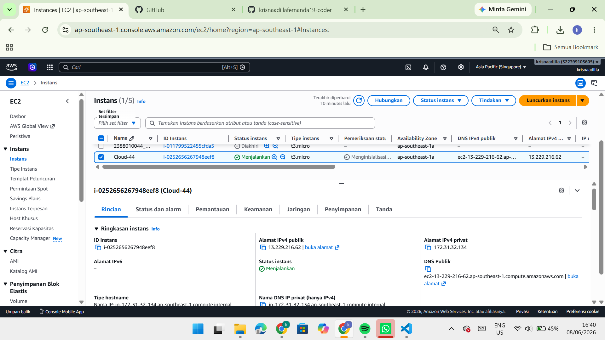
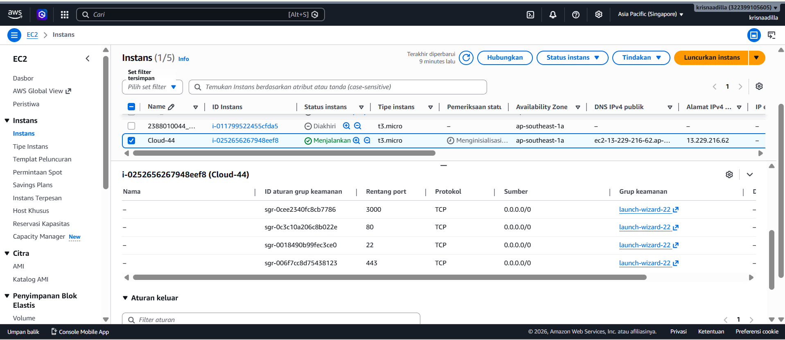
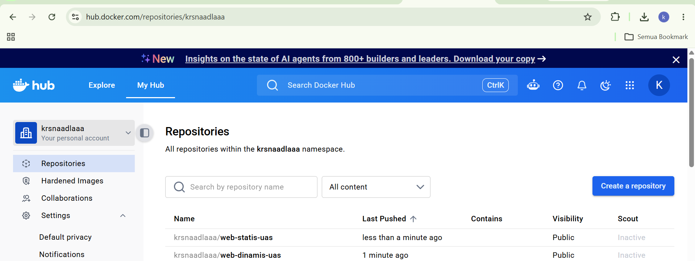
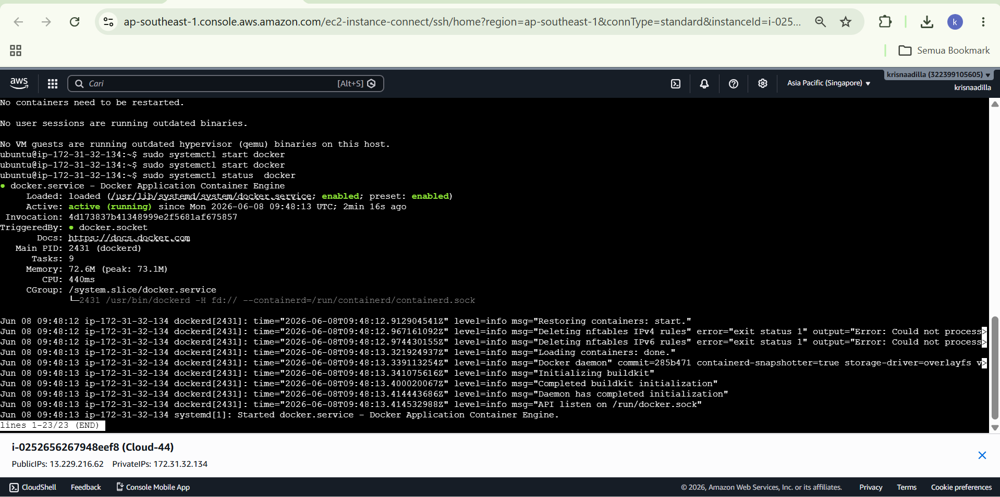
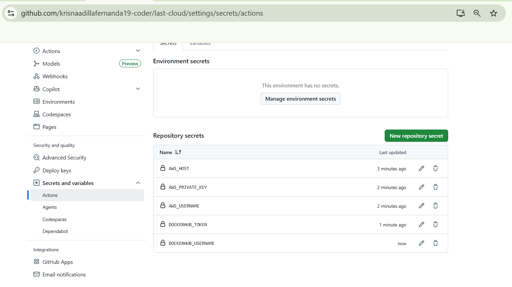
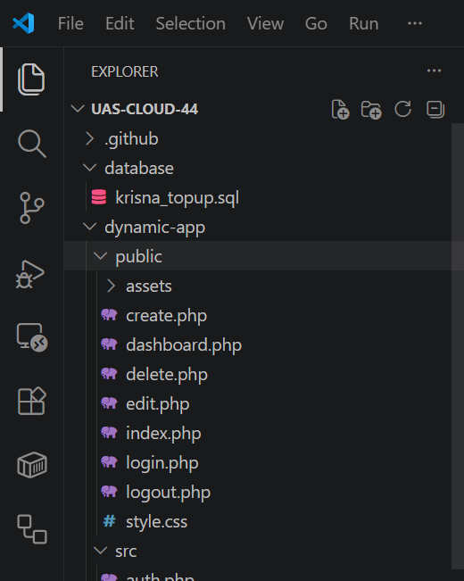
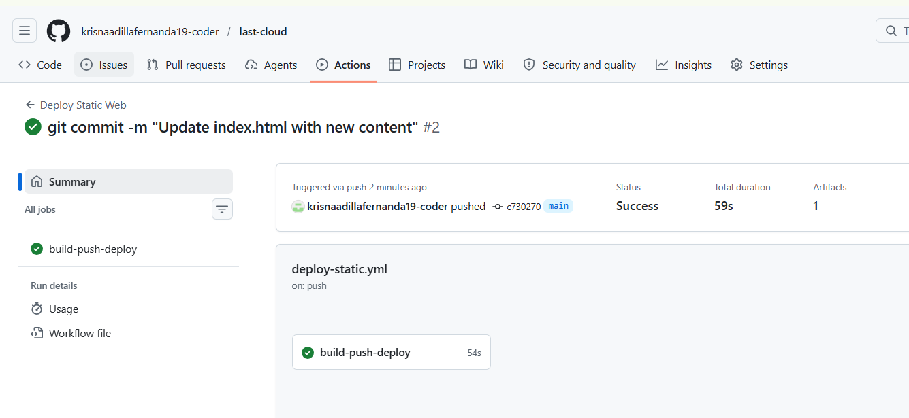
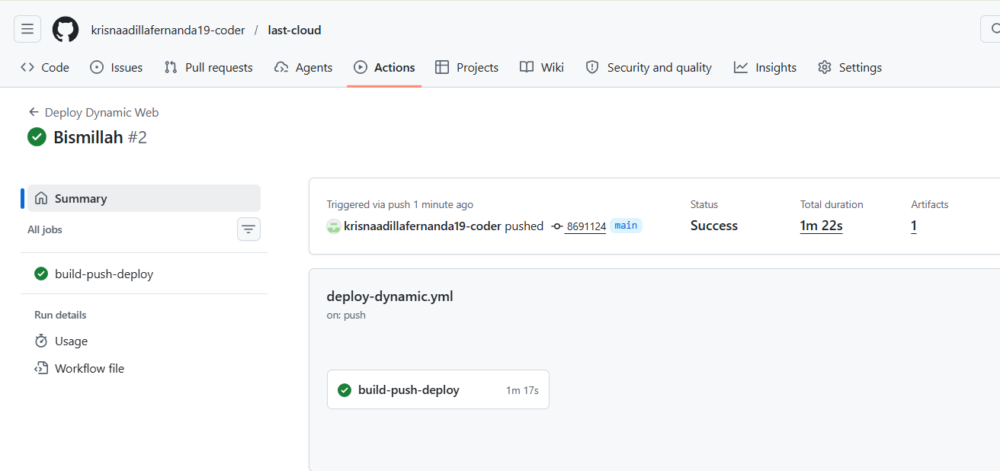
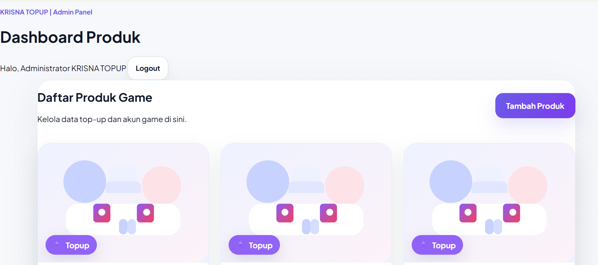
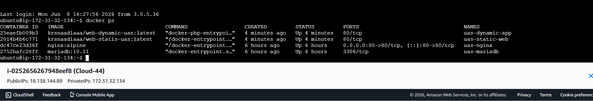

# WatchVault - Web Dinamis & Statis (UAS Administrasi Server)

## 🌐 Tautan Langsung ke AWS
*(IP Publik dari instance EC2)*
- **Web Statis (Port 80):** `http://18.138.144.89`
- **Web Dinamis (Port 3000):** `http://18.138.144.89:3000`

---

## 🏗️ Topologi Arsitektur & Penjelasan Environment

Proyek ini menerapkan arsitektur **Cloud Native** dan menggunakan sistem Continuous Integration/Continuous Deployment (CI/CD) yang diotomatisasi melalui GitHub Actions.

### 1. Struktur Orkestrasi Jaringan (Docker Compose)
- **Aplikasi terpisah:** Pipeline dipisahkan dengan teknik `Paths Filter` agar eksekusi CI/CD antara `web-statis` (Nginx Alpine) dan `web-dinamis` (PHP Apache 8.2) terisolasi dan efisien.
- **DNS Internal & Keamanan:** Kontainer aplikasi terhubung dengan database melalui jaringan Docker *bridge* kustom. Nama kontainer (`mariadb-dinamis`) digunakan sebagai host database.
- **Environment Variables:** Konfigurasi kredensial diamankan menggunakan `env` (seperti `DB_NAME`, `DB_USER`, `DB_PASSWORD`) yang diinjeksi saat build/run.
- **Automasi Database:** Data awal untuk web dinamis di-seeding secara otomatis dengan melakukan mount volume `./db/init.sql:/docker-entrypoint-initdb.d/init.sql:ro`.
- **Persistensi Data:** Database menggunakan volume `watchvault_mariadb_data:/var/lib/mysql` untuk mencegah kehilangan data saat kontainer direstart.

---

## 📸 Log Pengujian & Bukti Deploy

### 1. Persiapan Infrastruktur (AWS EC2 & Docker)
*Pembuatan instance EC2 dan konfigurasi Security Group.*
![Bikin Instance EC2]![alt text]
![Bikin Security Group]

*Instalasi Docker Engine dan penyiapan repositori Docker.*
![Bikin Repo Docker]
![Install Docker di EC2]

### 2. Konfigurasi CI/CD Pipeline
*Pembuatan repositori GitHub dan injeksi rahasia (Secrets/Variables).*
![Bikin Repo & Secret]

*Pembuatan kode Docker Compose dan Dockerfile.*
![Push Kode ke GitHub]

### 3. Eksekusi Deploy ke EC2 (Zero-Touch Deployment)
*Deployment otomatis web statis (Port 80) melalui runner Github Actions.*
![Deploy Web Statis]

*Deployment otomatis web dinamis beserta MariaDB.*
![Deploy Web Dinamis]

### 4. Hasil Uji Coba Aplikasi & Port Mapping
*Akses ke Web Statis (Port 80) berhasil dan berjalan normal.*
![Akses Web Statis]

*Akses ke Web Dinamis (Port 3000) dan Database berfungsi normal.*
![Akses Web Dinamis]

### 5. Bukti Zero Downtime (Live Test Auto-Update)
> **Catatan Ujian Live:** (Tambahkan screenshot proses push kode baru dan tampilan di browser yang langsung berubah secara otomatis tanpa masuk ke server EC2).

- **Proses Git Push & Github Actions Sukses:**
  ![Proses Git Push & Github Actions Sukses]