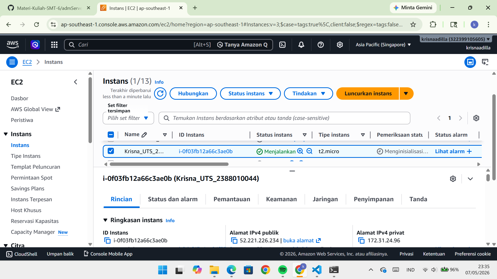
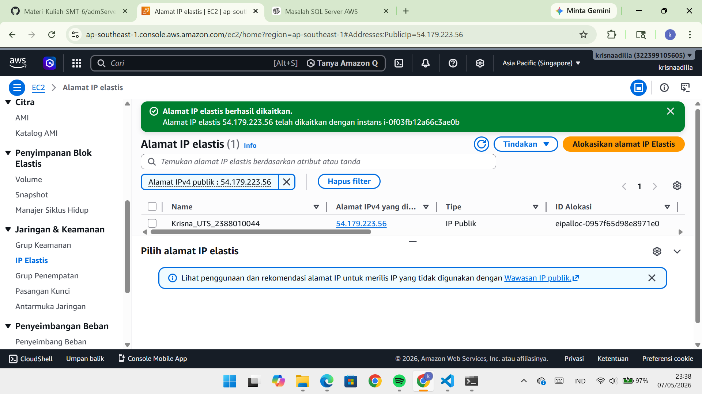
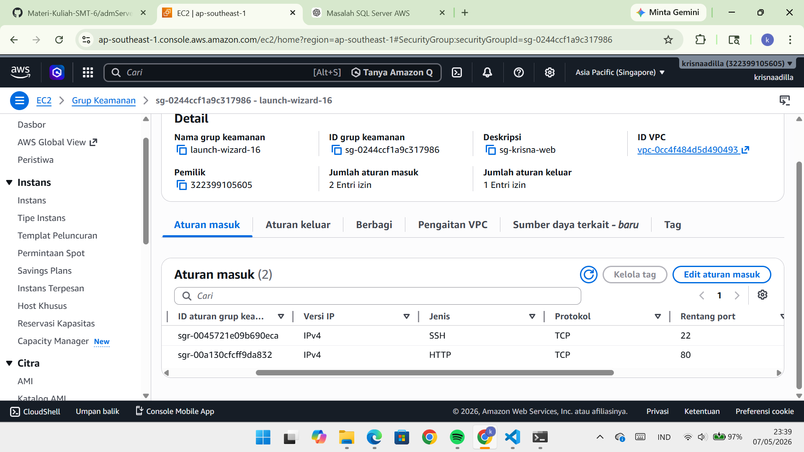
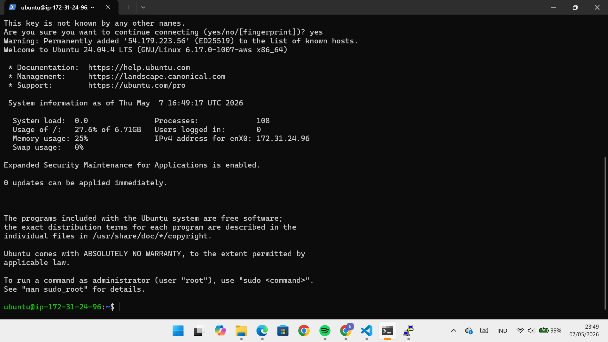
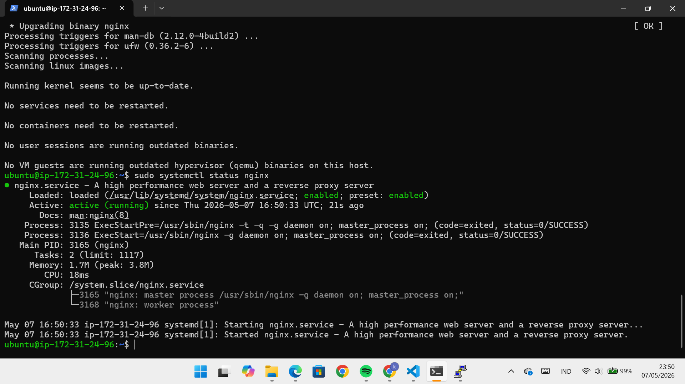
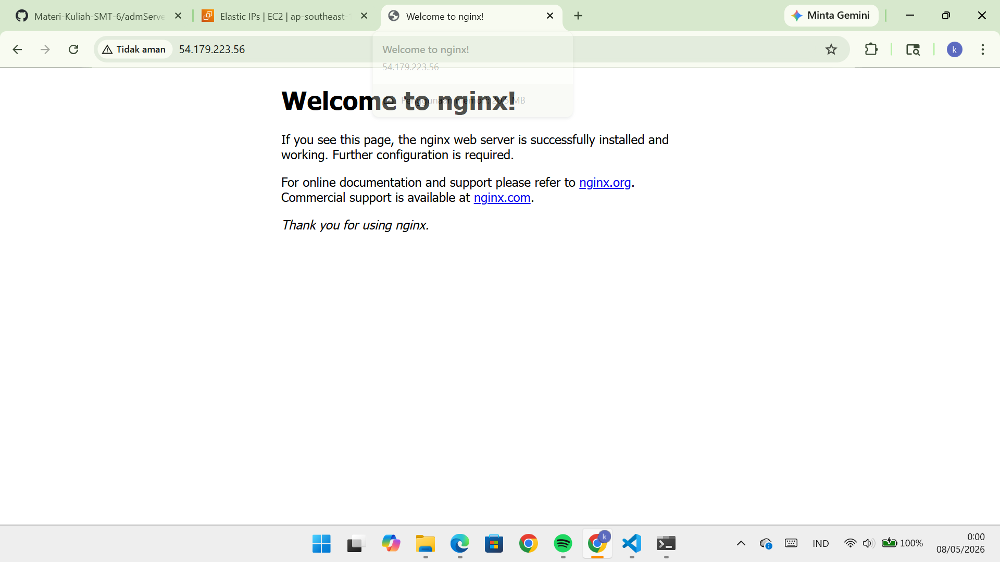
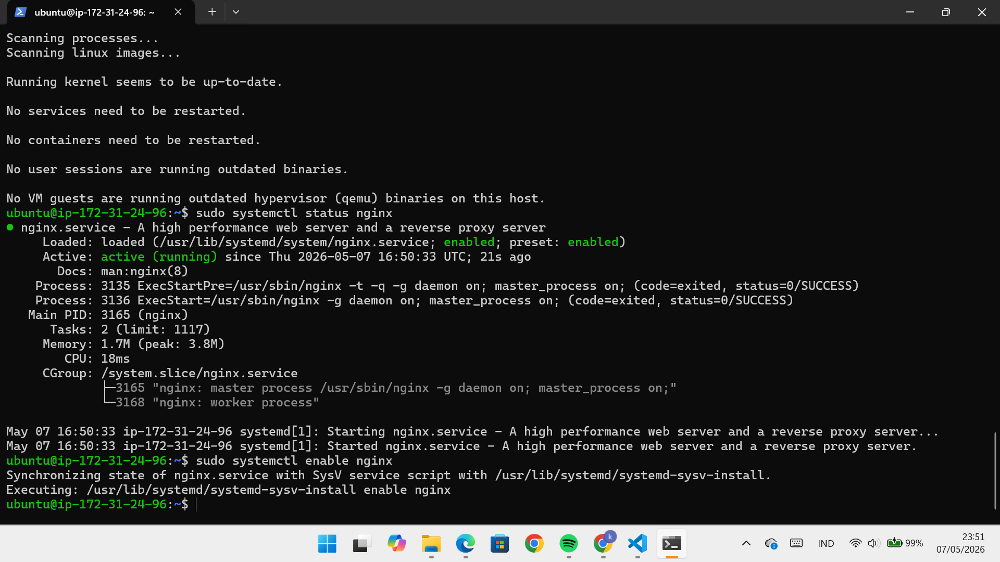
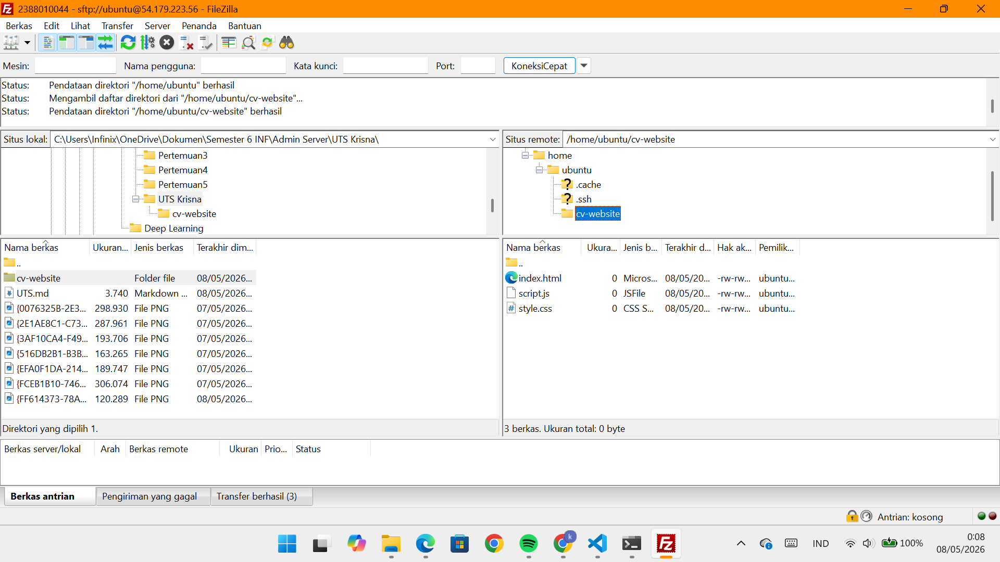
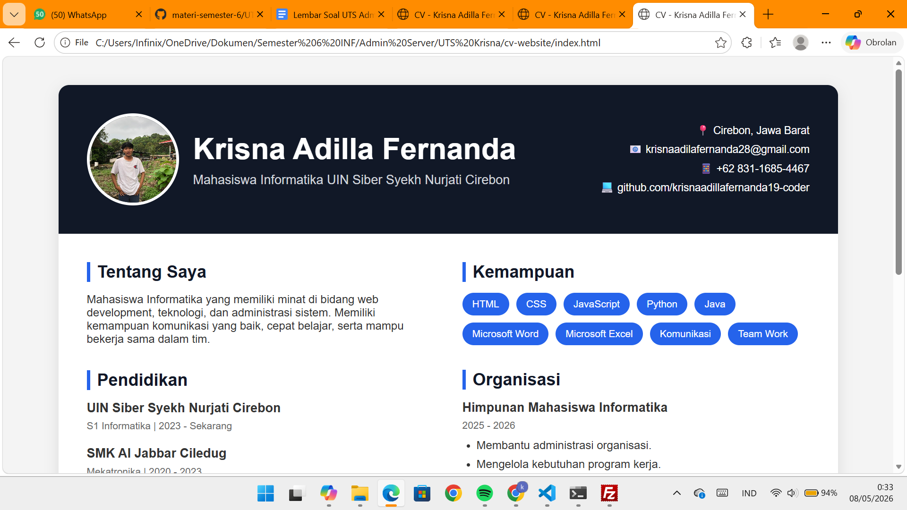

# Laporan UTS Administrasi Server

Krisna Adilla Fernada | 2388010044 | Informatika 6A

1. Tahap Provisioning & Security
- Membuat instance EC2 di region Singapore (ap-southeast-1) dengan nama uts_2388010026, tipe t2.micro/t3.micro, dan OS Ubuntu 22.04/24.04.
- Mengatur Key Pair, B. SPESIFIKASI INFRASTRUKTUR YANG DIMINTA
Region: Wajib menggunakan region Singapore (ap-southeast-1).
Compute: * Amazon EC2 Instance dengan OS Ubuntu 22.04 LTS atau 24.04 LTS.
Tipe Instance wajib t2.micro atau t3.micro (Free Tier Eligible).
Storage: 8 GB General Purpose SSD (gp2/gp3).
Security & Access:
Wajib menggunakan Key Pair (Tidak boleh menggunakan password/EIC).
Security Group: Hanya buka Port 80 (HTTP) dari Anywhere (0.0.0.0/0) dan Port 22 (SSH) hanya dari IP Publik Anda sendiri (My IP).
Web Server: Menggunakan Nginx (Bukan Apache).
Monitoring: Wajib mengaktifkan Detailed CloudWatch Monitoring dan membuat 1 buah Alarm jika penggunaan CPU menyentuh >80%.

C. INSTRUKSI PENGERJAAN (STEP-BY-STEP)
Tahap 1: Provisioning & Security (30 Poin)
- Buat instance EC2 sesuai spesifikasi di atas.

- Buat Elastic IP (EIP) dan Attach (hubungkan) EIP tersebut ke instance EC2 Anda secara permanen.

- Konfigurasi Security Group dengan ketat sesuai aturan di atas.

Tahap 2: Konfigurasi Web Server (30 Poin)
- Lakukan remote login (SSH) ke dalam server Anda menggunakan PuTTY atau Terminal.

- Lakukan instalasi web server Nginx.

- Pastikan service Nginx berstatus running dan enabled.

Tahap 3: Deployment Aplikasi Web CV (40 Poin)
- Siapkan source code Web CV / Portofolio Pribadi Anda (berbasis HTML/CSS/JS). Anda diizinkan menggunakan template gratis dari internet, namun wajib dimodifikasi dengan Data Diri Asli Anda (Foto, Riwayat Pendidikan, Skill, dll).
- Gunakan aplikasi SFTP (seperti FileZilla atau WinSCP) untuk memindahkan source code Web CV tersebut dari laptop Anda ke dalam server.

- Pindahkan source code tersebut ke Document Root Nginx/Apache (biasanya di /var/www/html).

PENTING: Atur Ownership dan Permissions (chown & chmod) pada folder website tersebut secara benar agar Nginx (www-data) bisa membacanya tanpa terkena Error 403 Forbidden.
Validasi Ujian: Pastikan di bagian paling bawah website CV Anda (footer) terdapat tulisan tebal: "Dideploy oleh: [Nama Lengkap Anda] - [NIM Anda]".storage 8 GB, serta Security Group (SSH: My IP, HTTP: 0.0.0.0/0).
1. Menjalankan instance hingga running, lalu membuat dan menghubungkan Elastic IP agar IP tetap.

3. Security Group Inbound Rules (menunjukkan Port 22 hanya diakses oleh My IP).

4. Mengaktifkan dan menjalankan nginx

5. Deployment Aplikasi Web
- Setelah layanan Nginx berhasil dijalankan, dilakukan pengujian dengan mengakses alamat IP publik (Elastic IP) melalui browser.
- Website CV yang telah diunggah kemudian berhasil ditampilkan, menandakan bahwa proses deployment berjalan dengan baik dan server dapat diakses secara online.
- Dengan demikian, konfigurasi web server dan proses upload file website telah berhasil dilakukan tanpa kendala.

